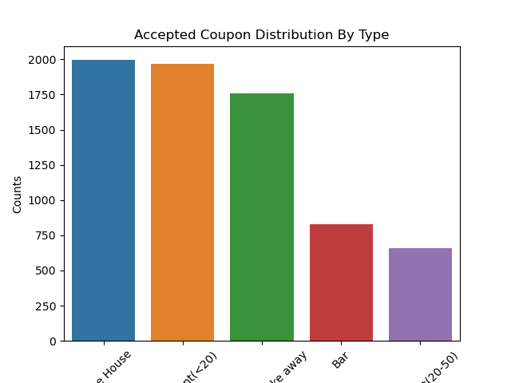
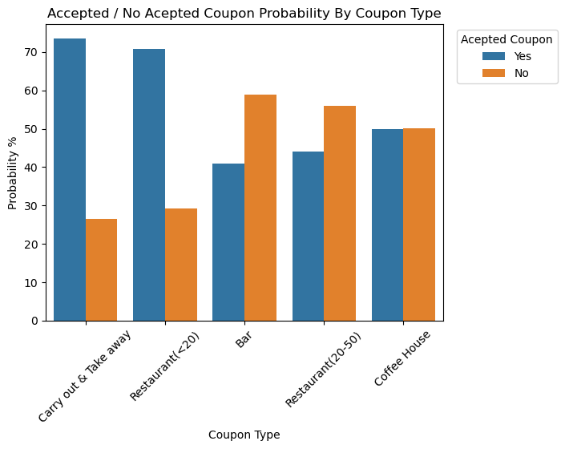

# Will-a-Customer-Accept-the-Coupon? #

#### Overview: ####

In this first practical application assignment of the program, you will seek to answer the question, “Will a customer accept the coupon?” The goal of this project is to use what you know about visualizations and probability distributions to distinguish between customers who accepted a driving coupon versus those that did not. Use the Practical Application Jupyter Notebook
Links to an external site. to complete this assignment.

#### Data: ####

This data comes to us from the UCI Machine Learning repository and was collected via a survey on Amazon Mechanical Turk. The survey describes different driving scenarios, including the destination, current time, weather, passenger, etc., and then asks people whether they will accept the coupon if they are the driver. Answers given that the users will drive there “right away” or “later before the coupon expires” are labeled as “Y = 1”, and answers “no, I do not want the coupon” are labeled as “Y = 0”. There are five different types of coupons—less expensive restaurants (under $20), coffee houses, carry out and take away, bars, and more expensive restaurants ($20–$50).

#### Notebook Link ####

The following notebook contains all the development of the analysis carried out.

[prompt_assig5_1.ipynb](https://github.com/camorante/Will-a-Customer-Accept-the-Coupon/blob/main/practice_5_1_coupon.ipynb)

## Investigation Results and Conclusions ##

### Objetive: ###

The objective of this study is to analyze the probability of a customer accepting a promotional coupon while driving. Customer behavior in different contexts will be analyzed to determine if depending on the type of passengers carried affects the decision to accept or not a coupon. 

### Analysis: ###

The data will be carefully analyzed to identify the factors that significantly influence the decision to accept a coupon while driving depending on the type of passenger. Plots and calculations using the Pandas library will be used to estimate the probability of coupon acceptance as a function of the variables.

### Development: ###

I first check which types of coupons are the most accepted, then I check if the passengers have an impact on the final choice.

#### Analysis 1 ####

First, is to verify which coupon types are the most widely accepted.

##### Plot 1.1 #####

Verification of accepted coupons by type

   
   
##### Plot 1.2 #####

Second, we analyze the probability of each coupon type for accepted / unaccepted coupons

probability by type = (accepted coupons grouped by type / all coupons grouped by type ) concat (unaccepted coupons grouped by type / all coupons grouped by type )

   
   
##### Conclusion 1.1 #####

We observe in plot 1.1 that coffee house is the most accepted coupon type followed by cheap restaurants. This gives us an idea of the type of coupon a driver is most likely to accept, but this does not give us a definitive conclusion because there is some bias in the data as there are more coupons for coffee house and cheap restaurants than the other types.

If we analyze the probability in plot 1.2 of each coupon to be accepted or not and compare it between each type of coupon we realize that 'Carry out & Take Away' and 'Restaurant < 20' are the most likely to be accepted. In the case of 'Coffee House' it does not seem as high as we thought in plot 1.1 since this type of coupon has a lower probability than the two leading ones.