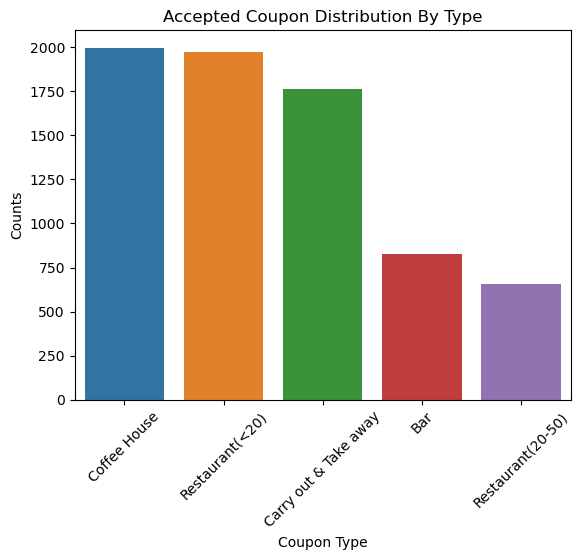
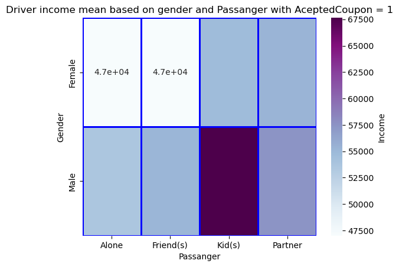

# Will-a-Customer-Accept-the-Coupon? #

#### Overview: ####

In this first practical application assignment of the program, you will seek to answer the question, “Will a customer accept the coupon?” The goal of this project is to use what you know about visualizations and probability distributions to distinguish between customers who accepted a driving coupon versus those that did not. Use the Practical Application Jupyter Notebook
Links to an external site. to complete this assignment.

#### Data: ####

This data comes to us from the UCI Machine Learning repository and was collected via a survey on Amazon Mechanical Turk. The survey describes different driving scenarios, including the destination, current time, weather, passenger, etc., and then asks people whether they will accept the coupon if they are the driver. Answers given that the users will drive there “right away” or “later before the coupon expires” are labeled as “Y = 1”, and answers “no, I do not want the coupon” are labeled as “Y = 0”. There are five different types of coupons—less expensive restaurants (under $20), coffee houses, carry out and take away, bars, and more expensive restaurants ($20–$50).

#### Notebook Link ####

The following notebook contains all the development of the analysis carried out.

[prompt_assig5_1.ipynb](https://github.com/camorante/Will-a-Customer-Accept-the-Coupon/blob/main/practice_5_1_coupon.ipynb)

## Investigation Results and Conclusions ##

### Objetive: ###

The objective of this study is to analyze the probability of a customer accepting a promotional coupon while driving. Customer behavior in different contexts will be analyzed to determine if depending on the type of passengers carried affects the decision to accept or not a coupon. 

### Analysis: ###

The data will be carefully analyzed to identify the factors that significantly influence the decision to accept a coupon while driving depending on the type of passenger. Plots and calculations using the Pandas library will be used to estimate the probability of coupon acceptance as a function of the variables.

### Development: ###

I first check which types of coupons are the most accepted, then I check if the passengers have an impact on the final choice.

#### Analysis 1 ####

First, is to verify which coupon types are the most widely accepted.

##### Plot 1.1 #####

Verification of accepted coupons by type

   
##### Plot 1.2 #####

Second, we analyze the probability of each coupon type for accepted / unaccepted coupons

probability by type = (accepted coupons grouped by type / all coupons grouped by type ) concat (unaccepted coupons grouped by type / all coupons grouped by type )

   
##### Conclusion 1.1 #####

We observe in plot 1.1 that coffee house is the most accepted coupon type followed by cheap restaurants. This gives us an idea of the type of coupon a driver is most likely to accept, but this does not give us a definitive conclusion because there is some bias in the data as there are more coupons for coffee house and cheap restaurants than the other types.

If we analyze the probability in plot 1.2 of each coupon to be accepted or not and compare it between each type of coupon we realize that 'Carry out & Take Away' and 'Restaurant < 20' are the most likely to be accepted. In the case of 'Coffee House' it does not seem as high as we thought in plot 1.1 since this type of coupon has a lower probability than the two leading ones.

#### Analysis 2 ####

We analyze the probability of coupon acceptance when we segment by passenger and coupon type.

##### Plot 2.1 #####

Coupon Probability By Coupon Type and Passanger with AceptedCoupon in (1,0)

##### Plot 2.2 #####

Driver income mean based on coupon type and passanger with AceptedCoupon = 1

##### Plot 2.3 #####

Driver income mean based on coupon type and passanger with AceptedCoupon = 1

##### Conclusion 2.1 #####

We can deduce from plot 2.1 that the predominant coupons that are most likely to be accepted for all passenger types are 'Restaurant(<20)' and 'Carry out & Take away'. Something to note in the analysis is the 'Bar' coupon type which is quite rejected when the passenger is 'Kid(s)', which makes sense since for obvious reasons children cannot enter a place where alcoholic beverages are served and drivers tend to ignore them probably for that reason. Bar is the least likely coupon to be accepted for each passenger category with the exception of the 'Friend' category.

If we relate the types of passengers to the average income of the driver (plot 2.2 and plot 2.3) we notice that those within the 'Alone' and 'Friend' categories are more likely to accept a coupon if they have a lower than average income, something that is not seen with the 'Kid(s)' type which is quite the opposite since it is those with a higher average income who are more likely to accept the coupon. As for 'partner' we can see here that the 'Bar' and 'Carry out & Take away' coupon types tend to have a higher probability of being accepted by those with higher than average incomes.

#### Analysis 3 ####

We analyze the probability of coupon acceptance when we segment by passenger and Gender.

##### Plot 3.1 #####

Coupon Probability By Gender and Passanger with AceptedCoupon in (1,0)

##### Plot 3.2 #####

Driver income mean based on gender and passanger with with AceptedCoupon = 1

##### Plot 3.3 #####

Driver income mean based on gender and Passanger with AceptedCoupon = 1

##### Conclusion 3.1 #####

In this analysis if we look at plot 3.1 we can see that both men and women have a very similar probability of acceptance between them for each of the passenger categories, only in the 'Alone' passenger category men tend to accept more than women. There is a higher probability of acceptance between men and women when the passenger type is 'Friend' and 'Partner' but tends to be lower when the passenger type is 'Alone' and 'Kid(s)'. 

With respect to Plot 3.2 and Plot 3.3 we can observe that women tend to be more likely to accept the coupon in the categories 'Alone', 'Friend' and 'Kid(s)' when their income is lower than the overall average income while men do so with a slightly higher average income in these same categories. In the 'Partner' category, on the other hand, the acceptance values based on income are closer between men and women and lie more in the middle of the income values.

#### Analysis 4 ####

We analyze the probability of coupon acceptance when we segment by passenger and coupon expiration.

##### Plot 4.1 #####

Coupon Probability By Expiration and Passanger with AceptedCoupon in (1,0)

##### Conclusion 4.1 #####

Plot 4.1 shows that there is a tendency for the condcutors to accept coupons that have a longer expiration time than those that expire more quickly, which is reflected for each type of passenger. 

The 2-hour coupon has a higher probability of acceptance than rejection in the 'Friends' and 'Partner' categories while the opposite is true in the 'Alone' and 'Kid(s)' categories where rejection is more pronounced than acceptance of the coupon.

The 24-hour coupon in all passenger categories always tends to be more accepted than rejected.

### Final Thoughts ###

As a summary of what I have observed, I have the following final conclusions.

1. The coupons 'Restaurant(<20)' and 'Carry out & Take away' has a higher probability of being accepted, 'Bar' is among the coupons that tend less likely to be accepted by condcutors.

2. When we group the data by passenger type, the coupons with the highest probability of being accepted are 'Restaurant(<20)' and 'Carry out & Take away' for all passenger types, only the coupon 'Bar' has the highest rejection ratio vs. acceptance when the passenger is 'Kid(s)'.

3. The 'Alone' and 'Friend' passenger categories are more likely to accept all types of coupons when the average income is somewhat low. In the 'Kid(s)' category, the opposite is true.

4. For men and women the average acceptance rate is higher in the 'Friend' and 'Partner' passenger categories while in the 'Alone' and 'Kid(s)' categories it tends to be lower.

5. Women coupon acceptors tend to have lower average incomes than men in each passenger category.

6. 24-hour coupons have a higher probability of acceptance than 2-hour coupons for all passenger categories. the rejection criterion for 2-hour coupons is higher in the 'Alone' and 'Kid(s)' categories. 
